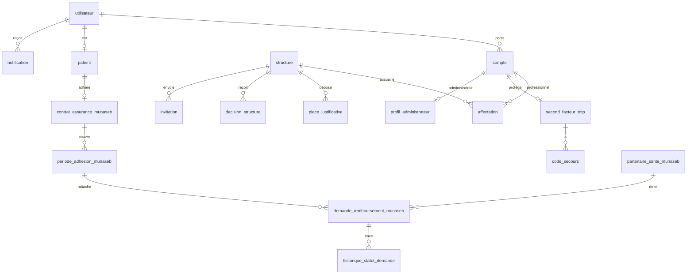
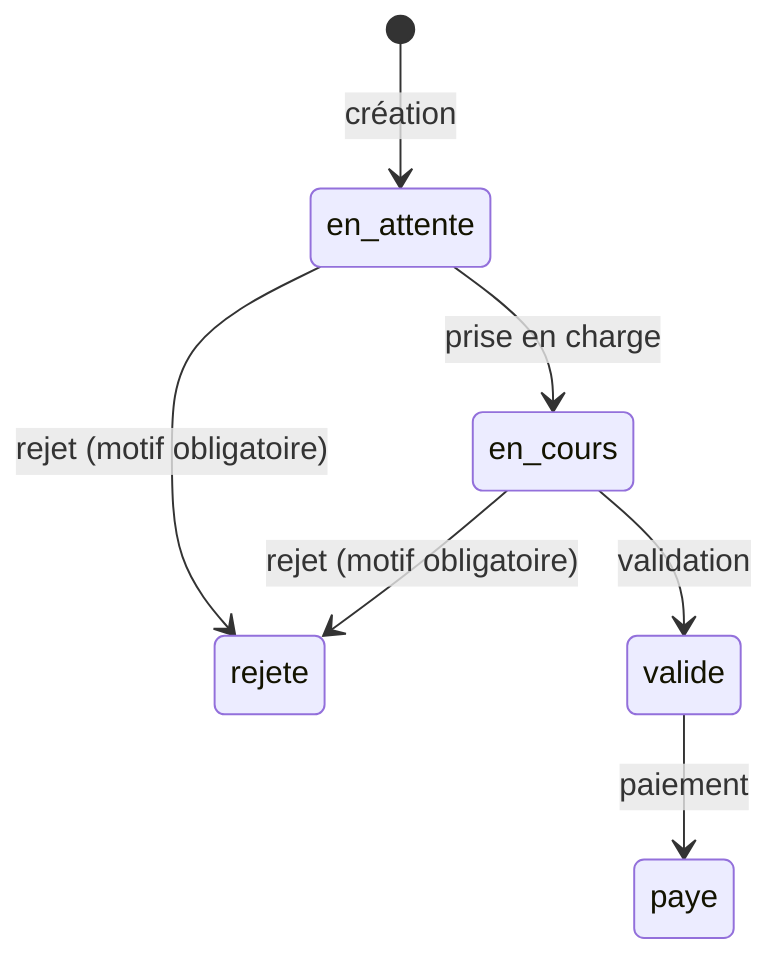
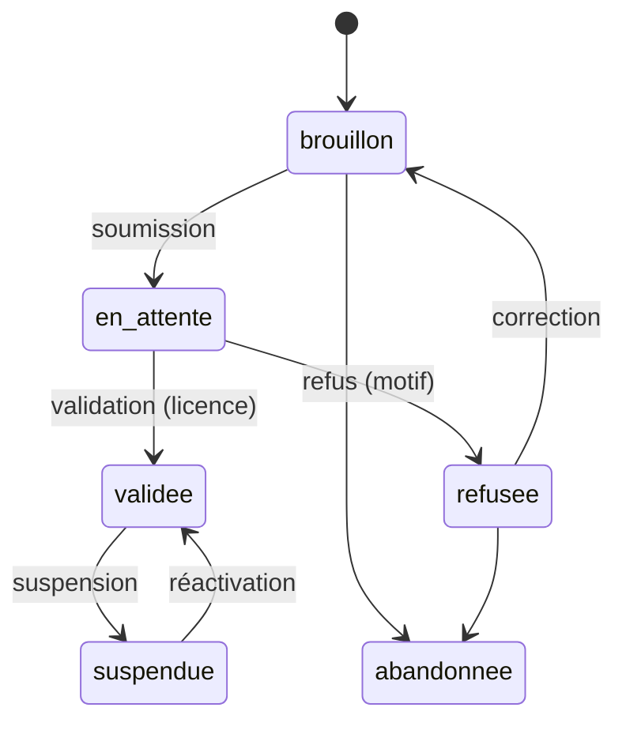

# Le modèle de données de LaafiCare

Ce document décrit **ce que la base de données enregistre** et **les règles qu'elle garantit elle-même**. Il est écrit pour quelqu'un qui n'a jamais programmé.

Quelques mots pour commencer :

- une **table** est un tableau : chaque **ligne** est un élément (une personne, une demande…), chaque **colonne** une information (un nom, une date…) ;
- un **identifiant** est un numéro unique attribué à chaque ligne, qui permet de la retrouver sans ambiguïté ;
- un **lien** (une *clé étrangère*) relie une ligne à une ligne d'une autre table : une demande de remboursement est liée à la période d'adhésion qu'elle concerne ;
- une **contrainte** est une règle que la base vérifie à chaque écriture et qui refuse ce qui ne la respecte pas (par exemple : « un numéro de téléphone ne peut appartenir qu'à une seule personne »).

La base est **PostgreSQL 18**. Sa structure est construite par des fichiers numérotés, les *migrations*, dans [`backend/migrations/`](../backend/migrations/). La liste est à la [fin de ce document](#les-migrations-une-par-une).

Seuls les modules en cours de développement sont décrits ici : identité et comptes, patients, mutuelle MUNASEB, établissements et second facteur. Les modules médicaux (dossier, ordonnances, pharmacie, laboratoire, suivi de grossesse) viendront ensuite.

---

## Vue d'ensemble

---

## 1. Identité et comptes

### `utilisateur` : l'identité d'une personne

| Information | Règle |
|---|---|
| nom, prénom | facultatifs au tout début (voir ci-dessous) |
| téléphone | **obligatoire et unique** : une seule personne par numéro, au format international (`+226…`) |
| email | facultatif, unique sans tenir compte des majuscules |
| code SMS en cours | son empreinte et sa date d'expiration (5 minutes) |

Une identité est créée dès qu'un numéro inconnu demande un code SMS pour s'inscrire, avec le téléphone seul. Le nom et le prénom sont ajoutés quand l'inscription est validée.

### `compte` : un compte de connexion

Une même identité peut avoir **plusieurs comptes**, un par type : `patient`, `professionnel`, `administrateur_laaficare`. Chaque compte a :

- **son propre mot de passe** (empreinte Argon2id) ;
- **son propre compteur d'essais** et sa date de fin de verrouillage (5 essais, 15 minutes) ;
- un **statut** (`actif` ou `desactive`) ;
- une **version de jeton**, augmentée à chaque changement sensible, pour invalider les anciennes connexions.

Règle garantie par la base : **un seul compte de chaque type par personne**.
Fichiers : [`verrouillage.rs`](../backend/src/verrouillage.rs), [`auth_patient.rs`](../backend/src/auth_patient.rs). Migration 0011.

## 2. Patients

### `patient`

| Information | Règle |
|---|---|
| identité | une seule fiche patient par identité |
| **NIP** | **16 chiffres, unique** : 15 chiffres d'un compteur global et 1 chiffre de contrôle (formule de Luhn), qui détecte une faute de frappe |
| date et lieu de naissance | obligatoires |

Le NIP ne contient **aucune information** sur la personne, ni année ni région : comme les identifiants de santé britannique ou australien, il ne doit rien révéler.
Fichier : [`nip.rs`](../backend/src/nip.rs). Migration 0003.

## 3. La mutuelle MUNASEB

MUNASEB est la mutuelle des étudiants du Burkina Faso. Son module est le premier développé ; un patient sans contrat MUNASEB utilise le reste de LaafiCare normalement.

### `contrat_assurance_munaseb` : l'adhésion d'un patient

Numéro de carte (unique), université, UFR, matricule, personne à prévenir, et **statut** (`actif` ou `suspendu`). Un patient a au plus un contrat.

### `periode_adhesion_munaseb` : les périodes couvertes

Chaque année payée est une **période** distincte, jamais écrasée.

- **Première adhésion** : la couverture commence **un mois après le paiement** (*carence*), puis dure 12 mois.
- **Renouvellement à temps** : la nouvelle période commence le lendemain de la fin de la précédente, sans carence.
- **Renouvellement en retard** : de nouveau un mois de carence ; les jours non couverts ne le sont pas rétroactivement.
- La date de paiement est celle du jour, fixée par le serveur, jamais saisie.

Règle garantie par la base : **deux périodes d'un même contrat ne se chevauchent jamais**.
Fichier : [`contrat_assurance_munaseb.rs`](../backend/src/contrat_assurance_munaseb.rs). Migration 0009.

### `tarif_acte_munaseb` : ce que rembourse la mutuelle

Une ligne par type d'acte, avec **soit un taux, soit un forfait** (jamais les deux) :

| Type d'acte | Prise en charge |
|---|---|
| consultation | 100 % |
| hospitalisation | 100 % |
| pharmacie | 80 % |
| laboratoire | 80 % |
| lunetterie | forfait de 15 000 FCFA |

Le **plafond** est de **100 000 FCFA par période d'adhésion**. Seules les demandes validées ou payées le consomment.

### `partenaire_sante_munaseb` : les établissements partenaires

Nom, type, ville, téléphone, statut. Un partenaire suspendu ne peut plus créer de demande. Cette table sera remplacée plus tard par un lien vers les établissements de la partie 4.

### `demande_remboursement_munaseb` : une demande de remboursement

Elle est créée par l'établissement partenaire pour le compte du patient (*tiers payant*) : référence et date de l'acte, montant de l'acte, montant demandé (calculé selon le tarif, puis **figé** : un changement de tarif ne modifie jamais une demande existante), montant remboursé, statut, motif de rejet. Elle est rattachée **dès sa création** à la période qui couvre la date de l'acte.

Règles :

- une validation plafonne le montant au solde restant de la période, **jusqu'à 0 FCFA** : une demande n'est jamais rejetée pour ce seul motif ;
- le montant remboursé existe si et seulement si la demande est validée ou payée ; un rejet a toujours un motif ;
- un partenaire ne peut pas envoyer deux fois la même référence d'acte.

Fichier : [`demande_remboursement_munaseb.rs`](../backend/src/demande_remboursement_munaseb.rs). Migration 0007.

### `historique_statut_demande` : la trace de chaque changement

Une ligne par changement de statut, création comprise, avec l'agent qui l'a fait et la date. **Ces lignes ne peuvent être ni modifiées ni supprimées** : la base le refuse (migration 0010).

### `notification` : les messages au patient

Chaque changement de statut d'une demande crée une notification, que l'application patient affichera : titre, message, lue ou non. Le texte reste **volontairement vague** (ni type d'acte, ni nom de l'établissement), car il pourrait un jour s'afficher sur l'écran verrouillé du téléphone. Une notification qui échoue n'annule jamais la demande.
Fichier : [`notification.rs`](../backend/src/notification.rs). Migration 0008.

## 4. Établissements, pièces et affectations

Ces tables existent (migration 0012), mais les fonctions et routes qui les utilisent viendront aux prochaines étapes.

### `structure` : un établissement

Clinique, hôpital, pharmacie, laboratoire ou MUNASEB, avec son nom, son téléphone, son adresse (commune et province obligatoires ; parcelle, lot et section facultatifs, pour les zones non loties) et ses coordonnées GPS.

Règles garanties par la base :

- **une seule demande non validée par personne** à la fois (contre les abus) ; une demande abandonnée libère la place ;
- **une seule MUNASEB validée** ou suspendue ;
- avant validation, **aucun accès aux données des patients**.

### `piece_justificative` et `piece_contenu` : les autorisations officielles

Le numéro d'autorisation est gardé **tel que saisi** et dans une **forme normalisée** pour les comparaisons : majuscules, sans espaces, tous les tirets ramenés au tiret simple, préfixe « N° » retiré. Le fichier lui-même (PDF, JPEG ou PNG, 5 Mo au plus) est rangé dans une table séparée, pour qu'aucune liste ne le lise par erreur.

### `autorisation_validee` : le registre des autorisations

Une ligne par numéro d'autorisation validé. Elle garantit qu'**un même numéro ne peut servir qu'à un seul établissement validé**, sans qu'un simple brouillon puisse bloquer un vrai établissement.

### `decision_structure` : les décisions de l'équipe LaafiCare

Validation, refus, suspension ou réactivation, avec l'administrateur, la date, le motif et la date de fin de licence. **Jamais modifiées ni supprimées.**

### `affectation` : un rôle dans un établissement

Elle relie un **compte professionnel** à un **établissement** avec un **rôle** : responsable, directeur, chef de service, major, médecin, infirmier (sage-femme comprise), agent d'accueil, pharmacien, biologiste ou agent MUNASEB. Une personne peut avoir plusieurs rôles, dans un ou plusieurs établissements.

Règles garanties par la base :

- une affectation **ne s'efface jamais**, ni directement, ni en supprimant l'établissement ou le compte qu'elle relie ;
- elle ne se modifie **qu'une fois**, pour sa clôture (avec la date et l'auteur) ; tout le reste est figé ;
- **pas de réactivation** : une personne qui revient reçoit une nouvelle affectation, et l'historique garde toutes les périodes.

C'est ce qui permettra, plus tard, de savoir pour chaque acte médical qui l'a fait et dans quel établissement.

### `invitation` : faire entrer quelqu'un dans un établissement

Enregistrée au numéro de téléphone, valable 7 jours, avec son statut (en attente, acceptée, refusée, annulée). Une invitation acceptée est liée à l'affectation qu'elle a créée : on sait toujours qui a fait entrer qui, et quand.

## 5. Second facteur et administrateurs

Tables de la migration 0013 ; fichier : [`totp.rs`](../backend/src/totp.rs).

### `second_facteur_totp`

Le secret partagé avec l'application d'authentification, **chiffré** (36 octets), avec la valeur aléatoire utilisée pour le chiffrer et la version de la clé. Il est d'abord `en_attente`, puis `actif` après un premier code correct. La base garde aussi la période du dernier code accepté, pour qu'un code ne serve jamais deux fois.

Règle garantie par la base : **au plus un second facteur actif et un en attente par compte**.

### `code_secours`

Les 10 codes de secours, sous forme d'empreinte Argon2id, avec leur date d'utilisation. Ils disparaissent avec leur second facteur.

### `desactivation_totp`

La trace de chaque désactivation par l'équipe LaafiCare : compte concerné, administrateur, date, motif, et attestation que la pièce d'identité a été vérifiée (le numéro de la pièce n'est **pas** enregistré). **Jamais modifiée ni supprimée**, et un administrateur ne peut pas désactiver le second facteur de ses propres comptes.

### `profil_administrateur`

Le numéro de CNIB de chaque administrateur LaafiCare, **unique**, au format de la carte actuelle (la lettre B suivie de 8 chiffres). Il est rangé à part, pour ne jamais apparaître dans une connexion.

---

## Les migrations, une par une

| N° | Ce qu'elle apporte |
|---|---|
| 0001 | Identité (`utilisateur`) : téléphone unique au format international |
| 0002 | Code SMS de l'inscription et du mot de passe oublié |
| 0003 | Patient et NIP (16 chiffres) |
| 0004 | Nom et prénom facultatifs tant que l'inscription n'est pas validée |
| 0005 | Agent MUNASEB (table retirée par la migration 0011) |
| 0006 | Contrat MUNASEB |
| 0007 | Partenaires, tarifs et demandes de remboursement |
| 0008 | Statut du contrat et notifications |
| 0009 | Périodes d'adhésion, sans chevauchement |
| 0010 | Historique des statuts, non modifiable |
| 0011 | Comptes séparés (patient, professionnel, administrateur) |
| 0012 | Établissements, pièces, registre des autorisations, décisions, affectations, invitations |
| 0013 | Second facteur, codes de secours, désactivations, profil administrateur |

Une migration déjà appliquée ne change plus jamais : toute évolution passe par une nouvelle migration. Un test vérifie aussi qu'aucun caractère invisible ne s'y glisse ([`tests/caracteres_migrations.rs`](../backend/tests/caracteres_migrations.rs)).
